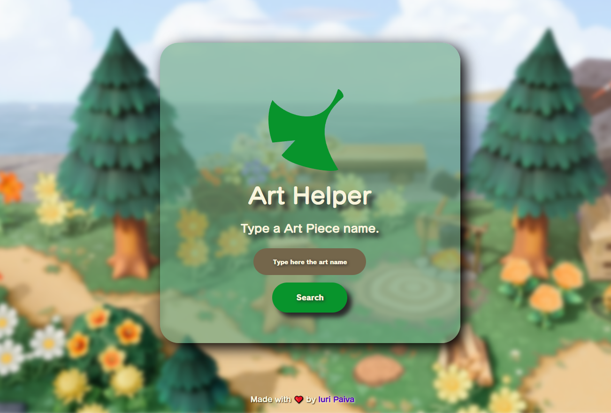
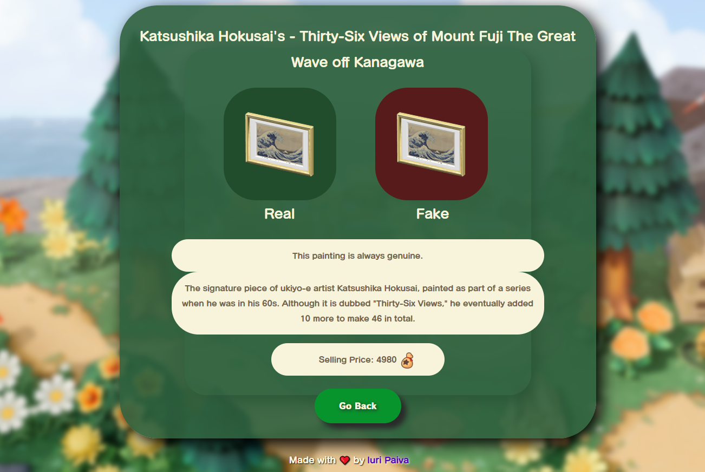
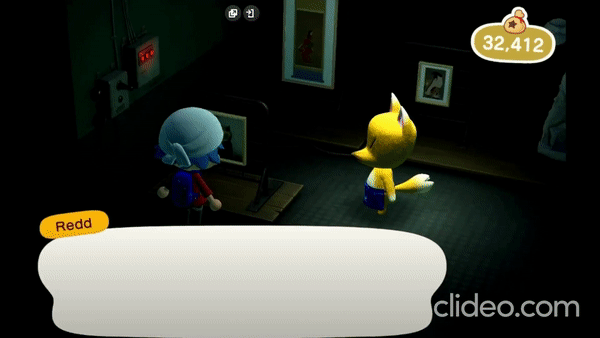

# Art-Helper
 Application developed using Nookipedia API

## How to use: 
  
- Whenever Jolly Redd comes to your island selling his suspicious art pieces, access this website and check if they are genuine or fake.
- Just type the name of the art piece you want to search and press enter or click the 'search' button.

  
  
  

#### API used in this project: https://api.nookipedia.com
#### For the tilt effect, i used the vanilla-tilt library: https://micku7zu.github.io/vanilla-tilt.js

## Disclaimer:

Art Helper is a fan made website and claims no ownership of any intellectual property associated with Nintendo or Animal Crossing. All assets found on the site and the repository are the sole property of Nintendo and are only used for non-commercial and educational purpose.

